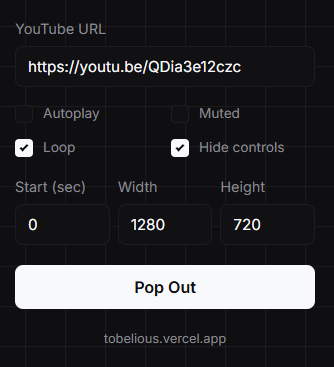

# YouTube Popout

A simple chrome extension to pop YouTube out into a cleaner, more minimal window.



## Features

* Pop out any YouTube video into a separate window
* Lightweight and simple UI
* Fast and easy to use
* Built for Chrome Extensions Manifest V3
* Great for multitasking while watching videos

## Installation

### Load Unpacked Extension

1. Download the [latest release](https://github.com/tobelious/youtubepopout/releases/latest)

2. Extract files

4. Open a Chromium browser and go to:

```txt
chrome://extensions
```

3. Click **Load unpacked**

5. Select the project folder

## Usage

1. Get a YouTube video link/ID
2. Click the extension icon
3. Paste in your link/ID
4. Adjust the settings to your preference
5. Click the pop out button

## Project Structure

```txt
youtube-popout-extension/
├── manifest.json
├── popup.html
├── popup.css
├── popup.js
└── icon.png
```

## License & Permission

Copyright © 2026 Tobelious

All rights reserved.

No permission is granted to use, copy, modify, distribute, sublicense, or sell this software without explicit written permission from the copyright holder.

## Links

* YouTube: [@ItsTheMaster223](https://www.youtube.com/@ItsTheMaster223)
* Webpage: [Tobelious](https://tobelious.vercel.app)
